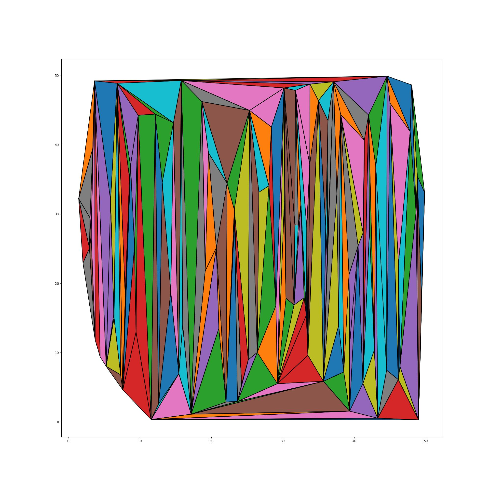
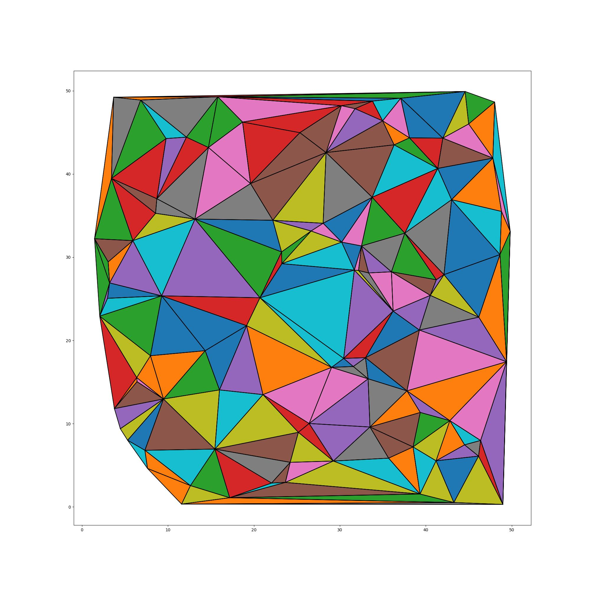

# Triangulation

At the Topological Data Analysis course I had to implement the line sweep algorithm for triangulation of $n$ points in a plane. 
We also had to make it "better" using edge flipping to get Delaunay Triangulation. (The Delaunay Triangulation maximizes the minimal angle in a triangulation).

## Line sweep triangulation

The function triangulate takes 2 parameters: $n$ points and a boolean that indicates whether the line sweep will be performed vertically or horisontaly. 

Here is an image of the result of the vertical line sweep triangulation over 50 points:

## Delaunay Triangulation

The Delaunay Triangulation maximizes the minimal angle in a triangulation. I implemented the edge flipping algorithm that runs in $O(n^2)$ time. 

Triangulation is Delaunay if and only if every edge in a triangulation is locally Delaunay. We can check for every edge if it is locally Delaunay by using simple in circle test.

Given three points \(A(x_a, y_a)\), \(B(x_b, y_b)\), and \(C(x_c, y_c)\), and a fourth point \(P(x_p, y_p)\), the in-circle test checks whether \(P\) is inside the circumcircle of triangle \(ABC\).

The test involves calculating the determinant of a matrix:

\[ \begin{vmatrix}
x_a - x_p & y_a - y_p & (x_a - x_p)^2 + (y_a - y_p)^2 \\
x_b - x_p & y_b - y_p & (x_b - x_p)^2 + (y_b - y_p)^2 \\
x_c - x_p & y_c - y_p & (x_c - x_p)^2 + (y_c - y_p)^2 \\
\end{vmatrix} \]

If the determinant is positive, point \(P\) lies outside the circumcircle; if it's negative, \(P\) lies inside; and if it's zero, \(P\) is on the circle's boundary.

If the point is inside we perform an edge flip.

After the edge flipping algorithm the triangulation from line sweep example looks like this:
